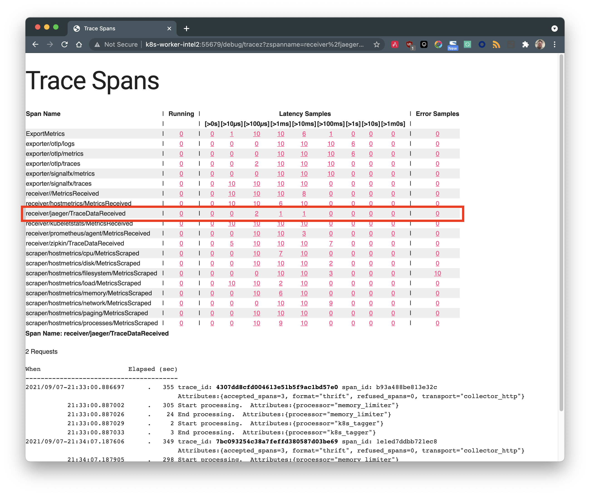
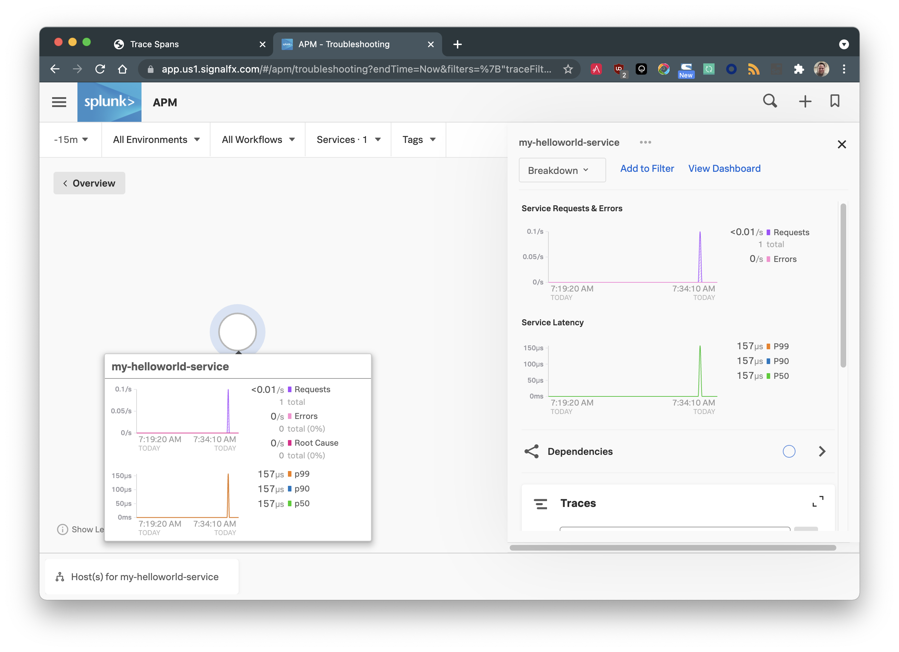
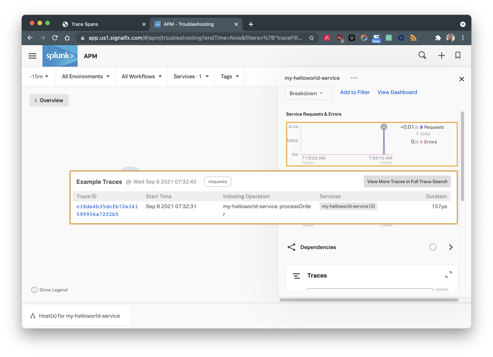
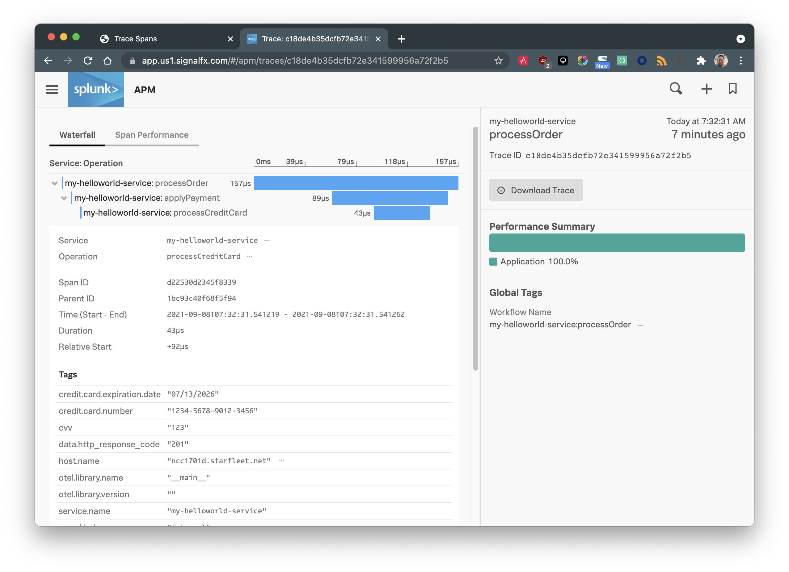

# send-trace

This short python script is useful for sending OpenTelemetry traces to an OpenTelemetry collector.

## Setup

Install the module dependencies with

```bash
pip3 install -r requirements.txt
```

## Enable zPages in the OpenTelemetry Collector

Enabling the zPages extension in the OpenTelemetry collector is a useful troubleshooting aid.  See https://github.com/open-telemetry/opentelemetry-collector/blob/main/docs/troubleshooting.md for more details.

Once enabled, browsing to the `http://<otelhostname>:55679/debug/tracez` page will show a history of the spans that have been sent to and processed by the collector.  This is one mechanism to confirm traces are being received and processed by the collector.  See the *Viewing the results* section below for examples.

## Execution

Execute the script by running it with python and passing the hostname of the OpenTelemetry collector as an argument to the script:

```bash
python3 send-python.py <otel collector hostname>
```
```
OTEL Host:  k8s-worker-intel2
Sending trace to k8s-worker-intel2...
Hello world from OpenTelemetry Python!
Done.
```

## Viewing the results 

### Confirm the OpenTelemetry collector received the trace

Open a browser window and navigate to the OpenTelemetry collector to confirm the trace was received.  The URL uses this format:

```
http://<otelhostname>:55679/debug/tracez
```

On this page, there should be a span named `receiver/jaeger/TraceDataReceived` and under the `Latency Samples`, there should be a least one span received:



### View the trace in Splunk Observability

Sign into Splunk Observability and navigate to __APM__ &rarr; __Explore__.  After a few minutes, the trace should appear in the Service Map:



To view the trace, under the __Service Requests & Errors__, click the purple spike that represents the trace that was sent:



This reveals a list of available traces for the time period that was clicked on.  View the trace by clicking on it's `Trace ID`.

The resulting trace and it's span information will be displayed similar to:


